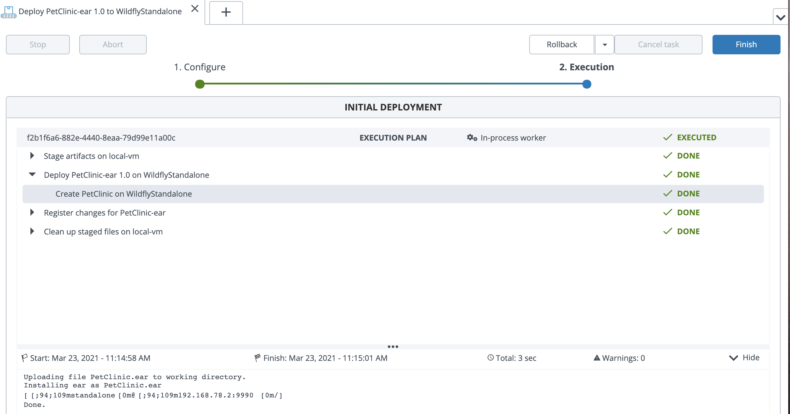

# Wildfire sample setup on Ubuntu

Sample demo setup to install/configure Wildfire and deploy a sample app with Digital.ai Deploy

## Install Wildfly on Ubuntu VM (192.168.78.2)

```
$ sudo apt-get update

$ sudo groupadd -r wildfly
$ sudo useradd -r -g wildfly -d /opt/wildfly -s /sbin/nologin wildfly

$ wget https://download.jboss.org/wildfly/18.0.1.Final/wildfly-18.0.1.Final.tar.gz -P /tmp

$ sudo tar xf /tmp/wildfly-18.0.1.Final.tar.gz -C /opt/

$ sudo ln -s /opt/wildfly-18.0.1.Final /opt/wildfly

$ sudo chown -RH wildfly: /opt/wildfly

$ sudo mkdir -p /etc/wildfly

$ sudo cp /opt/wildfly/docs/contrib/scripts/systemd/wildfly.conf /etc/wildfly/

$ sudo cp /opt/wildfly/docs/contrib/scripts/systemd/launch.sh /opt/wildfly/bin/

$ sudo cp /opt/wildfly/docs/contrib/scripts/systemd/wildfly.service /etc/systemd/system/

$ sudo systemctl daemon-reload

$ sudo systemctl start wildfly

$ sudo systemctl status wildfly
```

To enable at boot:

```
sudo systemctl enable wildfly
```

Create a Wildfly administrator:

```
$ sudo /opt/wildfly/bin/add-user.sh
````

To expose the administration console change the file /opt/wildfly/standalone/configuration/standalone.xml

```
<interfaces>
    <interface name="management">
        <inet-address value="192.168.78.2"/>
    </interface>
    <interface name="public">
	    <inet-address value="192.168.78.2"/>
    </interface>
</interfaces>
```

The web console is available at http://192.168.78.2:8080

The administrative console is available at http://192.168.78.2:9990/console

## Import the Infrastructure and Environment

To import the Digital.ai elements run the following command:

```
./xlw apply xl-deploy -f gitops/gitops.yaml
```

## Import the PetClinic.ear app (from the server)

## Deploy the app.



